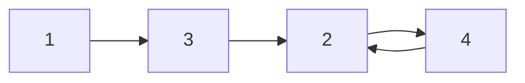

# [JavaScript 刷题] 双指针 - leetcode 142 & leetcode 287

github repo 地址: <https://github.com/GoldenaArcher/js_leetcode>，Github 的目录 ~~大概~~ 会更新的更勤快一些。

## 142. 判断链表是否存在环 II

题目地址：[142. Linked List Cycle II](https://leetcode.com/problems/linked-list-cycle-ii/)

### 142 题目

如下：

> Given the `head` of a linked list, return _the node where the cycle begins. If there is no cycle, return `null`_.
>
> There is a cycle in a linked list if there is some node in the list that can be reached again by continuously following the `next` pointer. Internally, `pos` is used to denote the index of the node that tail's next pointer is connected to (**0-indexed**). It is `-1` if there is no cycle. **Note that `pos` is not passed as a parameter**.

**Do not modify** the linked list.

### 142 解题思路

嗯……[龟兔指针法](https://goldenaarcher.blog.csdn.net/article/details/125225923) 已经讲过了，这里简单就 cv 一下：

就是慢指针与快指针起初的时候放在起点，只要链表中存在环，那么之后就一定会碰上。

然后将其中一个指针放在 `head`，两个指针同时向前移动一格，最终就会在交点相遇。

这题也可以用 hashmap 做。

### 使用 JavaScript 解 142

```javascript
/**
 * Definition for singly-linked list.
 * function ListNode(val) {
 *     this.val = val;
 *     this.next = null;
 * }
 */

/**
 * @param {ListNode} head
 * @return {ListNode}
 */

var detectCycle = function (head) {
  let slow = head,
    fast = head;

  do {
    slow = slow?.next;
    fast = fast?.next?.next;
  } while (slow !== fast && fast !== null);

  if (!fast) return null;

  slow = head;

  while (slow !== fast) {
    slow = slow.next;
    fast = fast.next;
  }

  return fast;
};
```

## 287. 寻找重复数

题目地址：[287. Find the Duplicate Number](https://leetcode.com/problems/find-the-duplicate-number/)

### 287 题目

如下：

> Given an array of integers `nums` containing `n + 1` integers where each integer is in the range `[1, n]` inclusive.
>
> There is only **one repeated number** in `nums`, return _this repeated number_.
>
> You must solve the problem **without** modifying the array nums and uses only constant extra space.

### 287 解题思路

这题其实是一个变种的快慢指针问题，反正我这种菜鸡，如果没看题解的话，完全没想过可以这么做，毕竟题目中要求以 $O(n)$ 的时间复杂度和 $O(1)$ 的空间复杂度去解题，用的也不是 linkedlist 而是 array。

这道题本身是个数组，以题目中的 `[1,3,4,2,2]` 为例：

<table>
<tr>
<td>1</td>
<td>3</td>
<td>4</td>
<td>2</td>
<td>2</td>
</tr>
</table>

但是，如果以访问 `nums[i]` 的方式去看待这道题，它又可以被重新画成这个样子：



题目中已经声明了，一定会 **有** 重复数字，而且 **只有一个** 重复数字，因此，将其始做一个链表，每次都访问 `nums[i]` 就是形成无限循环。

这个时候，就可以使用快慢指针的思想去找到循环的结点，返回即可。

一个大佬曾经说过，这道题考的就是你做没做过这种题。如果没做过原题或者类似题，正常在面试压力下，如果考官不给足够的 hint，十有八九是过不去的……

不过，这道题也算是一个比较高频的面试题了，亚麻特别喜欢考这道题，在 6/11/2022 这天的看到的结果是这样的：


### 使用 JavaScript 解题 287

```javascript
/**
 * @param {number[]} nums
 * @return {number}
 */
var findDuplicate = function (nums) {
  let slow = nums[0],
    fast = nums[0];

  do {
    slow = nums[slow];
    fast = nums[fast];
    fast = nums[fast];
  } while (slow !== fast);

  slow = nums[0];

  while (slow !== fast) {
    slow = nums[slow];
    fast = nums[fast];
  }

  return slow;
};
```
