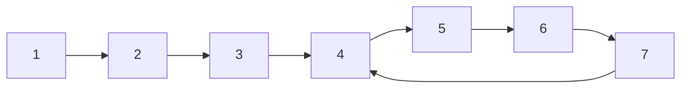
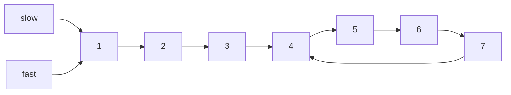
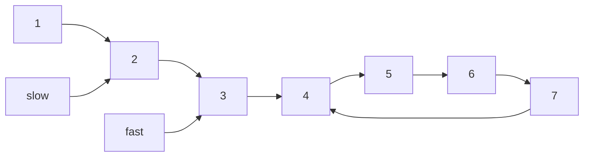
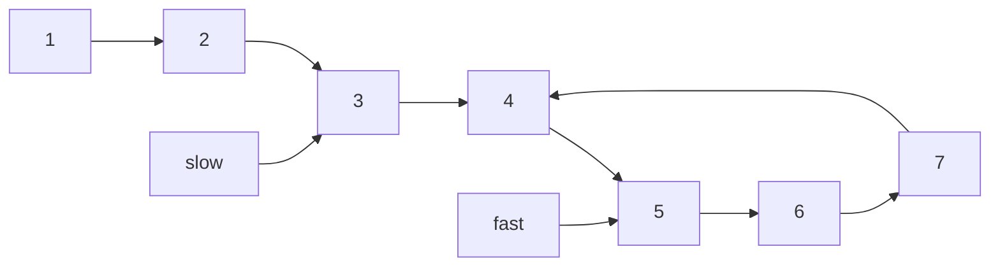
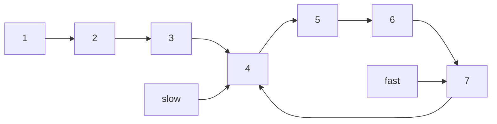
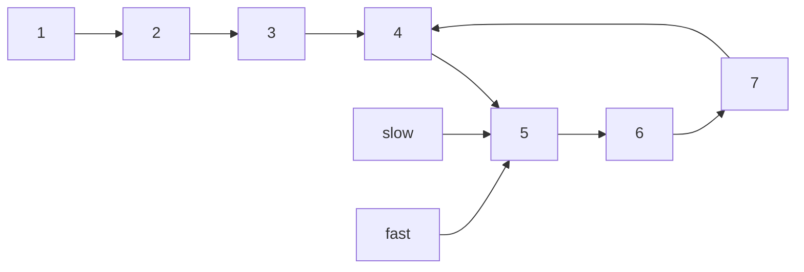

# 龟兔指针法

即 Floyd Cycle Detection Algorithm(Floyd 循环检测算法)，又名 Floyd's Tortoise and Hare(佛洛依德的乌龟和兔子)，快慢指针法，该算法主要用于检测链表内是否存在环。

## 原理

龟兔指针法的原理相对而言还是比较简单的，以以下链表为例：



快慢指针法会在最开始的时候将指针同时指向 `1`：



随后，只需要让快指针在每次移动时，比慢指针多移动一格：









只要存在循环，那么快慢指针就一定会相遇。

## 数学证明

以上面的图为例：


设 `1-4` 的部分为 $P$，`4-4` 圆圈的距离为 $C$，`5` 这个交点到 `4` 这个环的起点距离为 $X$，可以得出下面的公式：

$2 \times slow = fast$

$2(P + C - X) = P + nC - X$

$2P + 2C - 2X = P + nC - X$

环形的距离是可以抵消的，就得出

$2P - 2X = P - X$

最后得出：

$P = X$

所以这就是为什么使用快慢指针找到交点后，将另一个指针放在起点处，二者同时移动一格，就能够找到环形的起点。

## 时空复杂度分析

时间复杂度是 $O(n)$，不管怎么循环，只要存在环形链表，那么二者一定会相遇。

假设 $x$ 是起点到环形的距离，$y$ 为环形的长度，使用龟兔指针法，慢指针的行走长度最大为 $x + y$，而快指针的最大行走长度为 $2 (x + y)$。整个算法的上限依旧是 $O(n)$。

空间复杂度是 $O(1)$，只需要额外存储两个额外的空间即可。

对比使用 Hashmap 进行解决，二者的时间复杂度，看大 O 都是 $O(n)$，而看空间复杂度就差的比较多了。龟兔指针法的空间复杂度是 $O(1)$，最差情况下 hashmap 的空间复杂度是 $O(n)$，所以在只是检查环形链表的情况下，龟兔指针法比 hashmap 的解法要优一些。

## leetcode 题目

- [141. 判断链表是否存在环](https://goldenaarcher.blog.csdn.net/article/details/118078119)
- 142. 判断链表是否存在环 II
- [876. 链表的中间结点](https://goldenaarcher.blog.csdn.net/article/details/125211679)
- 287. 寻找重复数

  287 是一道变种题

## 延申

还有一个循环检测算法是 Brent’s Cycle Detection Algorithm，会比起龟兔指针法要更快一些。

其伪代码大致如下：

```python
def brent(head):
    if head is null:
        return head

    fast = head.next
    slow = head

    # power is 2^n
    powwer = 1
    steps = 1

    while fast != null and fast != slow:
        if (length == power):
            power *= 2
            length = 0
            slow = fast

        fast = fast.next
        steps++

    return slow
```

Brent 的做法是让快指针移动 $2^n$，在快指针结束移动后，让慢指针跳到快指针的位置。

Brent 的时空复杂度大 O 与 Floyd 的一致，不过因为快指针每次移动的步数是 $2^n$，所以在具体实践中会比固定移动 $2n$的 Floyd 快一些。
