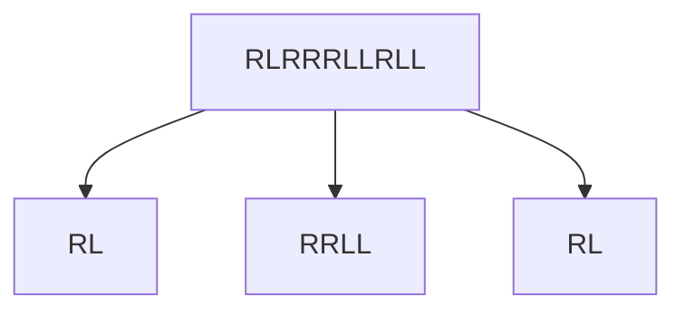
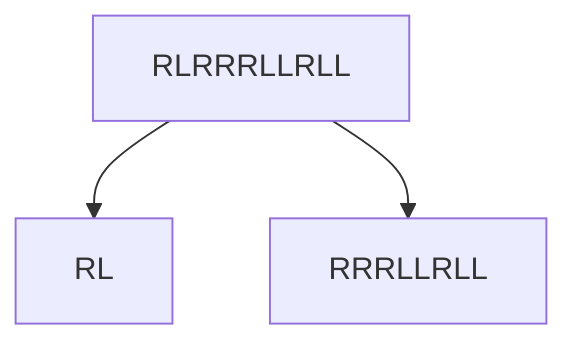

# [JavaScript 刷题] 贪心 - 分割平衡字符串, leetcode 1221

题目地址：[1221. Split a String in Balanced Strings](https://leetcode.com/problems/split-a-string-in-balanced-strings/)

题目如下：

**Balanced** strings are those that have an equal quantity of `'L'` and `'R'` characters.

Given a **balanced** string `s`, split it in the maximum amount of balanced strings.

Return _the maximum amount of split **balanced** strings_.

## 解题思路

这道题有点绕，我刚开始理解错误了……以错误的提交为例：



这样就应该有三个子字符串，不过答案是 2，原因是正确的分割方式应该如下：



还是因为对题目的理解有误，我以为是可以跳过一些字符。

一旦了解了题目之后，解题就变得挺容易的，毕竟题目中列明了：

- 只有 R 和 L
- R 和 L 的数量一致

因此使用一个数字去计算 R 和 L 的数量，当该数字为 0 时增加平衡字符串的数量即可。

## 使用 JavaScript 解题

```javascript
/**
 * @param {string} s
 * @return {number}
 */
var balancedStringSplit = function (s) {
  let balanced = 0;
  let counter = 0;
  for (let i = 0; i < s.length; i++) {
    const char = s[i];
    if (char === "R") balanced++;
    else balanced--;

    if (balanced === 0) counter++;
  }

  return counter;
};
```
