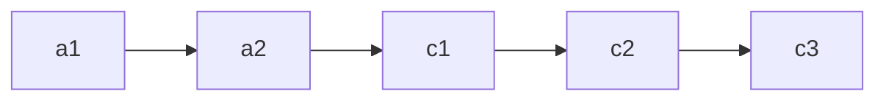
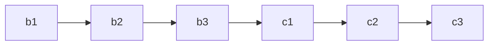
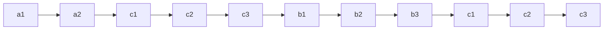
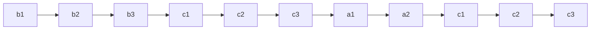

# [JavaScript 刷题] 链表 - 相交链表, leetcode 160

github repo 地址: <https://github.com/GoldenaArcher/js_leetcode>，Github 的目录 ~~大概~~ 会更新的更勤快一些。

题目地址：[160. Intersection of Two Linked Lists](https://leetcode.com/problems/intersection-of-two-linked-lists/)

## 题目

如下：

> Given the heads of two singly linked-lists `headA` and `headB`, return the node at which the two lists intersect. If the two linked lists have no intersection at all, return `null`.
>
> For example, the following two linked lists begin to intersect at node `c1`:
>
> 
>
> The test cases are generated such that there are no cycles anywhere in the entire linked structure.
>
> **Note** that the linked lists must **retain their original structure** after the function returns.
>
> **Custom Judge:**
>
> The inputs to the **judge** are given as follows (your program is not given these inputs):
>
> - `intersectVal` - The value of the node where the intersection occurs. This is 0 if there is no intersected node.
> - `listA` - The first linked list.
> - `listB` - The second linked list.
> - `skipA` - The number of nodes to skip ahead in listA (starting from the head) to get to the intersected node.
> - `skipB` - The number of nodes to skip ahead in listB (starting from the head) to get to the intersected node.
>
> The judge will then create the linked structure based on these inputs and pass the two heads, headA and headB to your program. If you correctly return the intersected node, then your solution will be **accepted**.

## 解题思路

这道题有两种解决方法，第一个是使用 Hashmap，将所有出现在 `listA` 或者是 `listB` 的 LinkedList Node 存到 Map 中，再遍历另一个 LinkedList 即可，这种做法的时间复杂度为 $O(m + n)$，空间复杂度为 $O(m, n)$。

另外一种做法则是不需要使用额外的空间去存储出现过的结点，依旧以上图为例，这时候的 `list1` 如下：



`list2` 如下：



只要将 `list1` 和 `list2` 拼接起来如下：



`list2` 拼接 `list1` 如下：



二者如果有公用的结点，在便利的时候一定会出现当下 `list1` 的结点与 `list2` 的结点一样的情况。

如果二者没有公用结点，那么在条件 `list1.node === list2.node` 不触发的情况下，循环结束之后 `list1` 和 `list2` 都会指向 `null`。

## 使用 JavaScript 解题

### 哈希表

```javascript
/**
 * Definition for singly-linked list.
 * function ListNode(val) {
 *     this.val = val;
 *     this.next = null;
 * }
 */

/**
 * @param {ListNode} headA
 * @param {ListNode} headB
 * @return {ListNode}
 */
var getIntersectionNode = function (headA, headB) {
  const set = new Set();
  while (headA !== null && headA.val !== null) {
    set.add(headA);
    headA = headA.next;
  }

  while (headB !== null && headB.val !== null) {
    if (set.has(headB)) return headB;
    headB = headB.next;
  }

  return null;
};
```

### 双指针

当 `l1` 和 `l2` 遍历完了 `headA + headB` 之后，二者会双双指向 `null`，触发 `null === null` 的条件。

```javascript
var getIntersectionNode = function (headA, headB) {
  let l1 = headA,
    l2 = headB;

  while (l1 !== l2) {
    l1 = l1 ? l1.next : headB;
    l2 = l2 ? l2.next : headA;
  }

  return l1;
};
```
