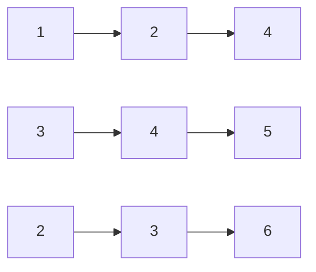
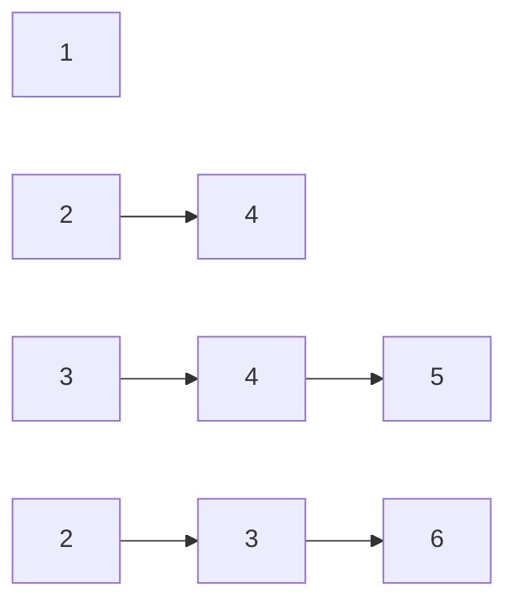
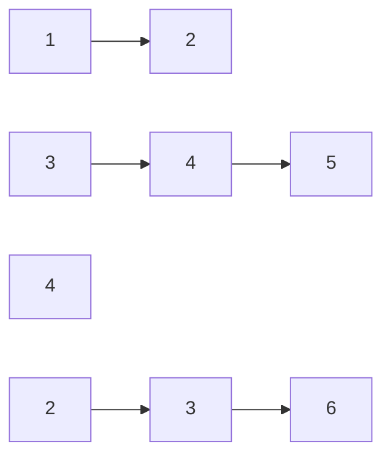
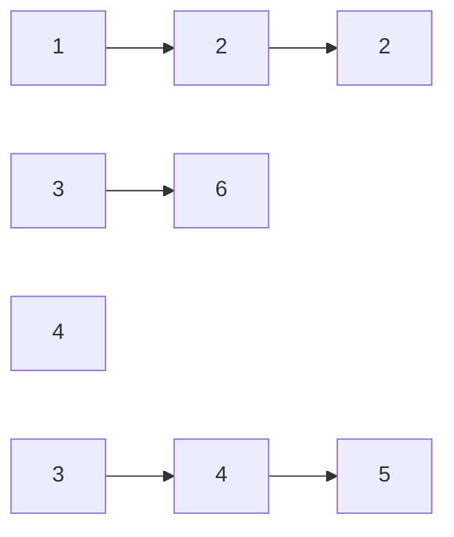

# 链表 - Leetcode 2 & Leetcode 23

github repo 地址: <https://github.com/GoldenaArcher/js_leetcode>，Github 的目录 ~~大概~~ 会更新的更勤快一些。

## 2. Add Two Numbers

题目地址：[2. Add Two Numbers](https://leetcode.com/problems/add-two-numbers/)

## Add Two Numbers 题目

如下：

> You are given two **non-empty** linked lists representing two non-negative integers. The digits are stored in r**everse order**, and each of their nodes contains a single digit. Add the two numbers and return the sum as a linked list.
>
> You may assume the two numbers do not contain any leading zero, except the number 0 itself.

## Add Two Numbers 解题思路

这道题应该来说还是比较简单的，只要知道怎么新建链表就能够完成这道题，而且题目中也说了，链表的顺序由左到右，也就不需要反转链表去实现。

整道题就跟图片上解释的那样去解就可以了：


唯一记得的事情就是可能需要补十。

## 使用 JavaScript 解 Add Two Numbers

```javascript
/**
 * Definition for singly-linked list.
 * function ListNode(val, next) {
 *     this.val = (val===undefined ? 0 : val)
 *     this.next = (next===undefined ? null : next)
 * }
 */
/**
 * @param {ListNode} l1
 * @param {ListNode} l2
 * @return {ListNode}
 */

// time complexity: O(n)
// space complexity: O(1)

var addTwoNumbers = function (l1, l2) {
  let res = new ListNode(0),
    reminder = 0;
  let dummy = res;

  while (l1 || l2) {
    let sum = (l1?.val || 0) + (l2?.val || 0) + reminder;
    reminder = sum >= 10 ? 1 : 0;
    sum = sum >= 10 ? sum - 10 : sum;
    dummy.next = new ListNode(sum);

    l1 = l1?.next;
    l2 = l2?.next;
    dummy = dummy.next;
  }

  if (reminder === 1) dummy.next = new ListNode(1);

  return res.next;
};
```

## 23. Merge k Sorted Lists

题目地址：

## Merge k Sorted Lists 题目

如下：

> You are given an array of `k` linked-lists `lists`, each linked-list is sorted in ascending order.
>
> _Merge all the linked-lists into one sorted linked-list and return it_.

## Merge k Sorted Lists 解题思路

还有两种解法，包括：

- divide & conquer

  这个之后做到这部分再来回顾好了

  D&C 的时间复杂度与 PQ 一样，都是 $O(n log(k))$

- priority queue

  主要还是 JavaScript 内部没有实现 PQ 数据结构，之前好像写过 PQ 的内容，不是很想重复一遍，等把 sort 的笔记整理出来之后再讲一下 heap 吧。

  使用 PQ 去解题是一个比较优的解题方法了，这个做法可以将时间复杂度压到 $O(n log(k))$，就我的理解来说很难找到比这个还要快的解法。

### 遍历所有的结点

这个就是一个一个遍历去做，其核心思想大概如下：



每一次都遍历当前的 lists，找出最小值，然后将最小值的指针指向 next，这里下一步的操作就是：



再一步是：



如此往复：



直到链表的数组遍历完比，返回即可。

这样的解法时间复杂度为 $O(k N)$，其中 $k$ 是数组的长度，$ N $ 是链表的总长度。

每次过程中都需要比较 $k-1$ 次才能够找到当前的最小值，总体来说时间复杂度还是比较高的解法。

### 排序

排序的时间复杂度为 $O(n log(n))$，这里会将所有的结点全都堆到一个新的数组里，然后再重写 `sort()` 中的 comparator 去进行排序，所以整体的时间复杂度是 $O(n log(n))$。

## 使用 JavaScript 解 Merge k Sorted Lists

### 解遍历所有的结点

```javascript
var mergeKLists = function (lists) {
  if (lists.length === 0) return null;
  if (lists.length === 1) return lists[0];
  const res = new ListNode(-Infinity);
  let temp = res,
    minList = lists[0],
    listIdx = 0;
  while (true) {
    nulls = 0;
    minList = lists[0] || new ListNode(Infinity);
    listIdx = 0;
    for (let i = 0; i < lists.length; i++) {
      if (lists[i] === null) {
        nulls++;
        continue;
      }
      if (lists[i].val < minList.val) {
        minList = lists[i];
        listIdx = i;
      }
    }
    if (minList.val === Infinity) return res.next;
    temp.next = new ListNode(minList.val);
    temp = temp.next;
    lists[listIdx] = minList.next;
  }
};
```

### 解排序

```javascript
var mergeKLists = function (lists) {
  const res = new ListNode(-1);
  let ptr = res;

  while (true) {
    let min = new ListNode(Infinity),
      minIdx = -1;

    for (let i = 0; i < lists.length; i++) {
      if (!lists[i]) continue;

      if (lists[i].val < min.val) {
        min = lists[i];
        minIdx = i;
      }
    }

    if (min.val === Infinity) break;

    ptr.next = new ListNode(min.val);
    lists[minIdx] = lists[minIdx].next;
    ptr = ptr.next;
  }

  return res.next;
};
```
