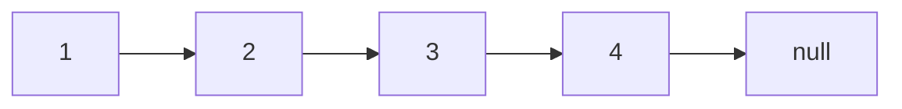
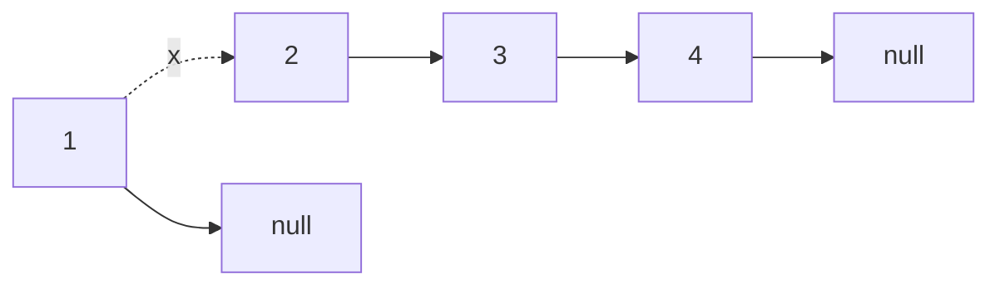

# [JavaScript 刷题] 链表 - 反转链表, leetcode 206

github repo 地址: <https://github.com/GoldenaArcher/js_leetcode>，Github 的目录 ~~大概~~ 会更新的更勤快一些。

题目地址：[206. Reverse Linked List](https://leetcode.com/problems/reverse-linked-list/)

## 题目

如下：

> Given the `head` of a singly linked list, reverse _the list, and return the reversed list_.

## 解题思路

这道题算是很多链表的基础题了，除此之外，这道题有两种常规解法，第一种是迭代，第二种是递归。

### 迭代

先设置两个变量，一个为 `curr` 指向当前结点，初始值为 `head`。另一个为 `prev` 指向上一个节点，初始值为 `null`。

以 `1 -> 2 -> 3 -> 4` 为例，最初的链表如下：



最初肯定是要将 `null` 挂到 `1` 后面去的：



使用 `curr.next = prev` 去进行关系的反转。但是这样，`1` 就失去了和剩下链表的关联，所以这里也需要额外用一个临时变量去保存 当前遍历下一个结点 的位置。

随后重复步骤，翻转链表结点间的关联即可。

### 递归

与迭代相比，递归的逻辑是反着来的，依旧以上面的链表为例：


因为递归在遇到 base case 之前会一直重复调用自身，所以这个链表会到 `null` 才会开始操作。这个时候会有两个可操作的值，第一个是 base case(`head.next === null`) 中的返回值，这个情况下就是 `4`，另一个则是当前的 `head`，目前为 `3`。

这个时候就可以将 `4.next` 指向 `3`，并且重复该步骤。

## 使用 JavaScript 解题

### 迭代解法

```javascript
/**
 * Definition for singly-linked list.
 * function ListNode(val, next) {
 *     this.val = (val===undefined ? 0 : val)
 *     this.next = (next===undefined ? null : next)
 * }
 */
/**
 * @param {ListNode} head
 * @return {ListNode}
 */
var reverseList = function (head) {
  let curr = head;
  let next = null;

  while (curr) {
    const prev = curr.next;
    curr.next = next;
    next = curr;
    curr = prev;
  }

  return next;
};
```

### 递归解法

这里就着代码再简单的捋一下逻辑。

```javascript
var reverseList = function (head) {
  // base case
  if (head === null || head.next === null) {
    return head;
  }
  let next = head.next;
  let newHead = reverseList(next);
  next.next = head;
  head.next = null;

  return newHead;
};
```


base case 的时候，`4` 既是 `newHead` 也是 `next`，而这个时候的 `head` 就是 `3`，因此使用 `next.next = head` 去进行关系的反转。递归每一个函数调用都会创建一个新的调用栈，因此当这一部分的逻辑处理完了之后，它会跳到下一个结点，也就是：


这个时候的 `next` 是 `3`，而 `head` 是 `2`。

代码的最后一定要将 `head.next` 指向 `null`，否则就会出现环形链表的问题。
