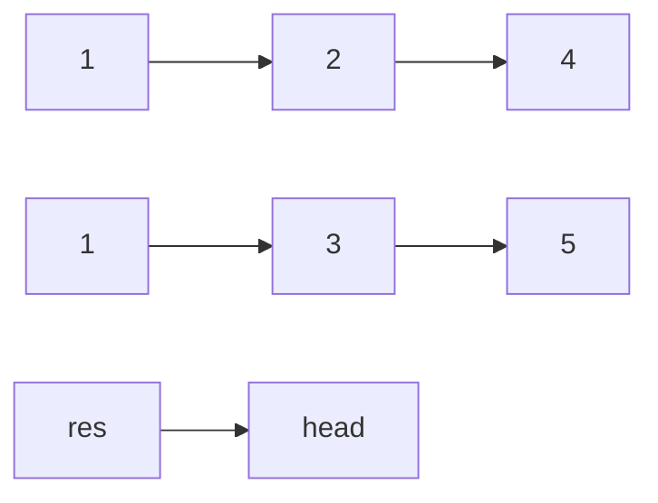
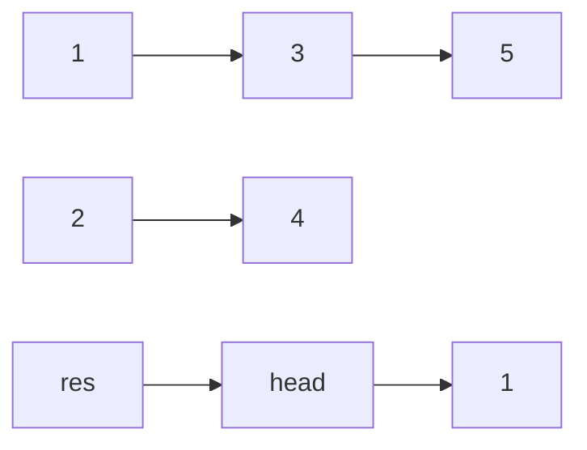
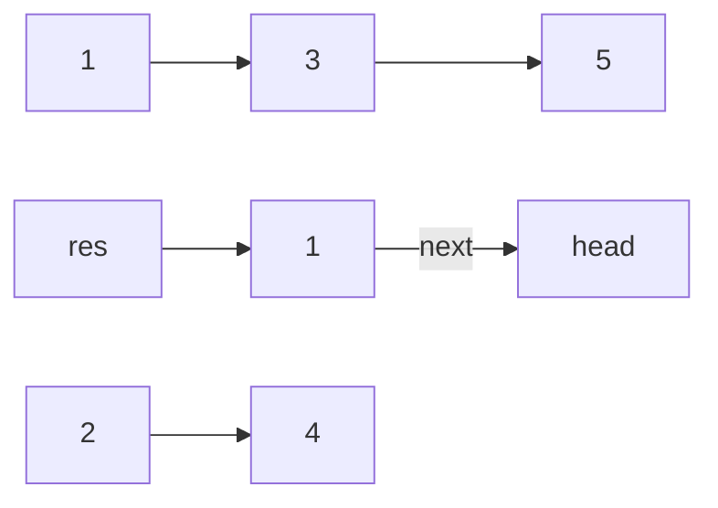

# [JavaScript 刷题] 链表 - 合并两个有序链表, leetcode 21

github repo 地址: <https://github.com/GoldenaArcher/js_leetcode>，Github 的目录 ~~大概~~ 会更新的更勤快一些。

题目地址：[21. Merge Two Sorted Lists](https://leetcode.com/problems/merge-two-sorted-lists/)

## 题目

如下：

> You are given the heads of two sorted linked lists `list1` and `list2`.
>
> Merge the two lists in a one **sorted** list. The list should be made by splicing together the nodes of the first two lists.
>
> Return _the head of the merged linked list_.

## 解题思路

单向 Linked List 是一个不可回溯的数据结构，因此首先这里就需要另外创建 2 个变量去保存 Linked List 的头部，一个用做返回值，另一个用于遍历。

在这之后，只需要遍历两个链表，判断哪个值比较小，将较小值连接到用于遍历的值上即可。

以题目中的例子来说，开局是这样的：



两个链表的第一个值都为 `1`，所以选择哪个差别都不是很大。第一轮遍历结束后如下：



后，更新 `head` 的指向：



这样才将 `1` 这个结点推入原本 `head` 所在的位置，然后让 `head` 指向 `head.next`。重复该步骤，知道 `list1` 和 `list2` 都被遍历过即可。

## 使用 JavaScript 解题

处理边界条件的部分稍微有些冗余。

```javascript
/**
 * Definition for singly-linked list.
 * function ListNode(val, next) {
 *     this.val = (val===undefined ? 0 : val)
 *     this.next = (next===undefined ? null : next)
 * }
 */
/**
 * @param {ListNode} list1
 * @param {ListNode} list2
 * @return {ListNode}
 */
var mergeTwoLists = function (list1, list2) {
  if (!list1 && !list2) return null;

  if (!list1 && list2) return list2;

  if (!list2 && list1) return list1;

  let l1 = list1,
    l2 = list2;

  if (l1.val > l2.val) {
    head = l2;
    l2 = l2.next;
  } else {
    head = l1;
    l1 = l1.next;
  }

  const res = head;

  while (l1 && l2) {
    if (l1.val < l2.val) {
      head.next = l1;
      l1 = l1.next;
    } else {
      head.next = l2;
      l2 = l2.next;
    }
    head = head.next;
  }

  while (l1) {
    head.next = l1;
    l1 = l1.next;
    head = head.next;
  }

  while (l2) {
    head.next = l2;
    l2 = l2.next;
    head = head.next;
  }

  return res;
};
```

除此之外，也看到一个非常精炼的使用递归完成的代码：

```java
/**
 * Definition for singly-linked list.
 * public class ListNode {
 *     int val;
 *     ListNode next;
 *     ListNode(int x) { val = x; }
 * }
 */
class Solution {
    public ListNode mergeTwoLists(ListNode l1, ListNode l2) {
        if (l1 == null || l2 == null)  return l1 == null ? l2 : l1;
        if (l1.val < l2.val) l1.next = mergeTwoLists(l1.next, l2);
        else l2.next = mergeTwoLists(l1, l2.next);
        return l1.val < l2.val ? l1 : l2;
    }
}
```
