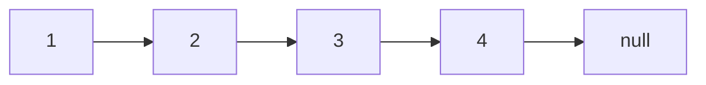
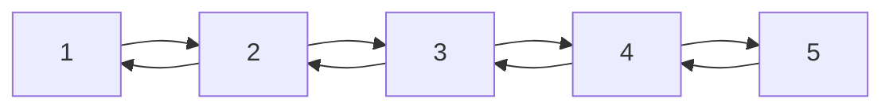

# 链表及双向链表

这里暂时不谈环形链表(circular linked list)。

## 链表

链表是一个非常有用的结构，与数组不同，它并不要求数据结构的内存地址保存在一起，而是可以通过指针/引用的方式，获取下一个结点的位置，因此，链表结构可以将散落的数据串联在一起，更大程度的利用空间，减少数据的重排。

链表结构如下：



每一个节点包含当前的值，以及下一个结点的引用。结点代码如下：

```javascript
class Node {
  constructor(val, next) {
    this.val = val !== undefined ? val : 0;
    this.next = next ? next : null;
  }
}
```

链表本身的实现就比较简单了，下面实现一些比较基础的功能。

首先是 LinkedList 的基础结构：

```javascript
class LinkedList {
  constructor() {
    this.head = null;
  }

  print() {
    let l1 = this.head;
    let res = [];

    while (l1?.next) {
      res.push(l1?.val, "->");
      l1 = l1.next;
    }

    res.push(l1?.val);

    console.log(res.join(" "));
  }
}
```

这里简单的实现了一个 `print` 功能，直接打印会出现 `circular object` 这种情况。

此时初始化后 `LinkedList` 会输出一个空字符串：


- appendToHead

  这个方法的目的是新建一个 Node，并且将这个 Node 加到链表的头部，其实现如下：

  1. 新建一个 Node：

     ```mermaid
     graph LR
     0

     head --> 1 --> 2 --> 3 --> 4
     ```

  2. 将新建结点的 `next` 指向原有的 head

     ```mermaid
     graph LR
     0 --> 1

     head --> 1 --> 2 --> 3 --> 4
     ```

  3. 将原有的 head 重置为现在的 head

     ```mermaid
     graph LR
     0 --> 1

     1 --> 2 --> 3 --> 4

     head --> 0
     ```

  代码实现如下：

  ```javascript
  class LinkedList {
    appendToHead(node) {
      const newNode = node instanceof Node ? node : new Node(node);

      if (!this.head) return (this.head = newNode);

      newNode.next = this.head;
      this.head = newNode;
    }
  }
  ```

  测试结果如下：

  

- appendToTail

  appendToTail 的实现与 appendToHead 相似，只不过这一次不是修改 `this.head`，而是将新建的结点连到当前链表最后一个结点后。其逻辑如下：

  1. 新建一个 Node：

     ```mermaid
     graph LR
     5

     head --> 1 --> 2 --> 3 --> 4
     ```

  2. 让当前链表中最后一个元素的 `next` 指向新建的结点

     ```mermaid
     graph LR
     4 --> 5

     head --> 1 --> 2 --> 3 --> 4
     ```

  这里主要的问题在于，链表无法像数组一样只靠下标就能过获取当前结点，因此这里需要依靠迭代去获取最后一个结点的位置。当然，也可以使用 `this.tail` 去保存最后一个结点，不过这会增加一些实现的复杂度，而且能实现 `head` 也能实现 `tail`，这里就偷懒了。

  实现如下：

  ```javascript
  class LinkedList {
    appendToTail(node) {
      const newNode = node instanceof Node ? node : new Node(node);

      if (!this.head) return (this.head = newNode);

      let l = this.head;
      while (l.next) {
        l = l.next;
      }

      l.next = newNode;
    }
  }
  ```

  测试结果如下：

  

- appendAfter

  这里就是实现将新建的结点连到某个结点之后，是 `appendToHead` 和 `appendToTail` 的结合了。

  1. 新建一个 Node：

     ```mermaid
     graph LR
     5

     head --> 1 --> 2 --> 3 --> 7
     ```

  2. 将 `prevNode` 的 `next` 指向 新创立的结点

     ```mermaid
     graph LR
     3 --> 5

     head --> 1 --> 2 --> 3 -..-> 7
     ```

  3. 将新建的结点的 `next` 指向 `prevNode` 的 `next`

     ```mermaid
     graph LR
     3 --> 5

     head --> 1 --> 2 --> 3

     5 --> 7
     ```

  实现代码如下：

  ```javascript
  class LinkedList {
    appendAfter(prevNode, node) {
      const newNode = node instanceof Node ? node : new Node(node);

      // 可以抛错，这里就直接返回了
      if (!prevNode) return;

      const next = prevNode.next;

      prevNode.next = newNode;
      newNode.next = next;
    }
  }
  ```

  测试结果如下：

  

## 双向链表

双向链表和普通链表的结构其实差不多，只不过在每个结点上会多使用一个空间去保存上一个节点的指针/引用，大体结构如下：



这样就能够解决向前追溯的问题，比如说 [146. LRU Cache](https://leetcode.com/problems/lru-cache/)。

这里就直接贴一下实现了：

```javascript
class Node {
  constructor(val) {
    this.val = val;
    this.prev = null;
    this.next = null;
  }
}

class DLL {
  // add node to the head of the dll
  push(data) {
    const newNode = data instanceof Node ? data : new Node(data);
    newNode.next = this.head || null;

    if (this.head) this.head.prev = newNode;

    this.head = newNode;
  }

  insertAfter(prevNode, data) {
    if (!prevNode) return;

    const newNode = data instanceof Node ? data : new Node(data);

    newNode;
    const nextNode = prevNode.next;
    prevNode.next = newNode;
    newNode.next = nextNode;

    newNode.prev = prevNode;
    nextNode.prev = newNode;
  }

  append(data) {
    const newNode = data instanceof Node ? data : new Node(data);

    if (!this.head) return (this.head = newNode);

    let last = this.head;
    while (last.next !== null) last = last.next;
    last.next = newNode;
    newNode.prev = last;
  }

  moveToHead(node) {
    const prevNode = node.prev,
      nextNode = node.next;

    prevNode.next = nextNode;
    if (nextNode) nextNode.prev = prevNode;

    node.next = this.head;
    this.head = node;
  }
}

const logDLL = (dll) => {
  const str = [];
  let head = dll.head;
  while (head.next) {
    str.push(head.val, "->");
    head = head.next;
  }

  str.push(head.val);

  console.log(str.join(" "));
};

const node8 = new Node(8);
const node9 = new Node(9);
const node10 = new Node(10);
const node11 = new Node(11);
const node1 = new Node(1);

const dll = new DLL();

dll.append(node11);

dll.push(node10);

dll.push(node8);

dll.append(node1);

dll.insertAfter(node8, node9);

logDLL(dll);

dll.moveToHead(node1);

logDLL(dll);
```
