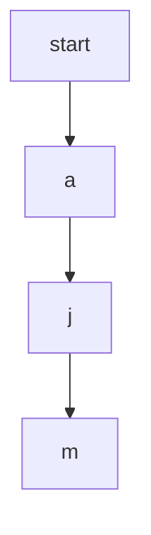
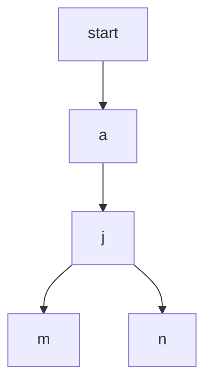

# [JavaScript 刷题] 搜索 - 电话号码的字母组合, leetcode 17

github repo 地址: <https://github.com/GoldenaArcher/js_leetcode>，Github 的目录 ~~大概~~ 会更新的更勤快一些。

题目地址：[17. Letter Combinations of a Phone Number](https://leetcode.com/problems/letter-combinations-of-a-phone-number/)

## 题目

如下：

> Given a string containing digits from `2-9` inclusive, return all possible letter combinations that the number could represent. Return the answer in **any order**.
>
> A mapping of digit to letters (just like on the telephone buttons) is given below. Note that 1 does not map to any letters.

## 解题思路

手机上的数字键如下：


也就是九键输入法。

这题其实又可以看成一个树的遍历，以 256 为例，可以将其转成树状结构：


这题基本上要求所有可能出现的组合，所以也就是个暴力解。

### DFS

比较常见的解法是 DFS，这种碰到某个点后返回继续搜索的类型又叫 Backtracking(回溯)，即在到达特定位置之后，返回重新求解。

[Leetcode 题解 - 搜索](https://github.com/CyC2018/CS-Notes/blob/master/notes/Leetcode%20%E9%A2%98%E8%A7%A3%20-%20%E6%90%9C%E7%B4%A2.md#1-%E6%95%B0%E5%AD%97%E9%94%AE%E7%9B%98%E7%BB%84%E5%90%88) 中是这么解释的：

> - 普通 DFS 主要用在 可达性问题 ，这种问题只需要执行到特点的位置然后返回即可。
>
> - 而 Backtracking 主要用于求解 排列组合 问题，例如有 { 'a','b','c' } 三个字符，求解所有由这三个字符排列得到的字符串，这种问题在执行到特定的位置返回之后还会继续执行求解过程。

这道题目边界条件较少，Backtracking 的解法就比较简单，依旧是以上面的图为例：


从原点开始向下使用递归进行遍历即可，返回条件——将当前字符串压入返回数组的条件——为：当前字符串长度与传进来的字符串长度相等，即 `'ajm'.length === '256'.length`。

### BFS


BFS 就是一层一层的解决，当度数为 1 是，BFS 中的 queue 包含：`['a', 'b', 'c']`，而到了下一层，queue 中包含的元素为：`['aj', 'ak', ..., 'cl']`。每次处理完当前层时，将下一层的组合继续压到 queue 中，一直到 queue 的长度为 0 即可。

本题中数组中的字符串长度与度数相同，同样当遇到 `'currStr'.length === '256'.length` 这样的条件就可以将 `currStr` 压到返回的数组中。

## 使用 JavaScript 解题

### DFS 解题

```javascript
const letterMaps = {
  2: ["a", "b", "c"],
  3: ["d", "e", "f"],
  4: ["g", "h", "i"],
  5: ["j", "k", "l"],
  6: ["m", "n", "o"],
  7: ["p", "q", "r", "s"],
  8: ["t", "u", "v"],
  9: ["w", "x", "y", "z"],
};

/**
 * @param {string} digits
 * @return {string[]}
 */
var letterCombinations = function (digits) {
  if (!digits || !digits.length || digits.length === 0) return [];

  const res = [];

  const backtrack = (i, currStr) => {
    if (currStr.length === digits.length) return res.push(currStr);

    for (const char of letterMaps[digits[i]]) {
      backtrack(i + 1, currStr + char);
    }
  };

  backtrack(0, "");

  return res;
};
```

这里使用了一个 closure 去减少传值，不使用 closuere 也一样，多传几个参数就行。

稍微解释一下 for 循环里面的递归，因为使用递归意味着函数会重复调用自己，第一个 return 的遍历路线为：



这时候 `'ajm'` 的长度与 `'256'` 相等，函数返回，这个时候会继续执行 `for (const char of letterMaps[digits[i]])` 里的代码。遍历如下：



如此反复一直到所有的循环结束。

使用递归写代码真的简洁很多。

### BFS 解题

比起来 BFS 的代码稍微乱一些：

```javascript
const letterMaps = {
  2: ["a", "b", "c"],
  3: ["d", "e", "f"],
  4: ["g", "h", "i"],
  5: ["j", "k", "l"],
  6: ["m", "n", "o"],
  7: ["p", "q", "r", "s"],
  8: ["t", "u", "v"],
  9: ["w", "x", "y", "z"],
};

/**
 * @param {string} digits
 * @return {string[]}
 */
var letterCombinations = function (digits) {
  if (!digits || !digits.length || digits.length === 0) return [];

  const queue = [...letterMaps[digits[0]]];

  const res = [];
  let index = 0;

  while (queue.length > 0) {
    index++;

    const size = queue.length;

    for (let i = 0; i < size; i++) {
      const curr = queue.shift();

      if (curr.length === digits.length) {
        res.push(curr);
        continue;
      }

      for (const char of letterMaps[digits[index]]) {
        queue.push(curr + char);
      }
    }
  }

  return res;
};
```

不过二者空间和运行时间没什么特别大的差别。

## 同类型题

### 257. Binary Tree Paths

题目地址：[257. Binary Tree Paths](https://leetcode.com/problems/binary-tree-paths/)，写法基本上一模一样，我也不另外开一篇笔记了，不然找起来都麻烦……


题目如下：

Given the `root` of a binary tree, return _all root-to-leaf paths in **any order**_.

A **leaf** is a node with no children.

代码如下：

```javascript
/**
 * Definition for a binary tree node.
 * function TreeNode(val, left, right) {
 *     this.val = (val===undefined ? 0 : val)
 *     this.left = (left===undefined ? null : left)
 *     this.right = (right===undefined ? null : right)
 * }
 */
/**
 * @param {TreeNode} root
 * @return {string[]}
 */
var binaryTreePaths = function (root) {
  if (!root || root.val === 0) return [];

  const res = [];
  const backtracking = (path, currNode) => {
    if (!currNode.left && !currNode.right)
      return res.push([...path, currNode.val].join("->"));

    if (currNode.left) backtracking([...path, currNode.val], currNode.left);
    if (currNode.right) backtracking([...path, currNode.val], currNode.right);
  };

  backtracking([], root);

  return res;
};
```
