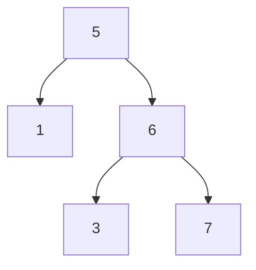

# [JavaScript 刷题] 树 - 验证二叉搜索树, leetcode 98

github repo 地址: <https://github.com/GoldenaArcher/js_leetcode>，Github 的目录 ~~大概~~ 会更新的更勤快一些。

题目地址：[98. Validate Binary Search Tree](https://leetcode.com/problems/validate-binary-search-tree/)

## 题目

如下：

> Given the `root` of a binary tree, _determine if it is a valid binary search tree (BST)_.
>
> A **valid BST** is defined as follows:
>
> - The left subtree of a node contains only nodes with keys **less than** the node's key.
> - The right subtree of a node contains only nodes with keys **greater than** the node's key.
> - Both the left and right subtrees must also be binary search trees.

## 解题思路

题目中第一点需求是：

> 左子树所包含的结点 **小于** 当前结点的值

第二点需求则是：

> 右子树所包含的结点 **大于** 当前结点的值

所以刚开始使用递归的时候就是这么写的：

```javascript
const validate = (root) => {
  if (!root) return true;

  if (root.val >= root?.left?.val || root.val <= root?.right?.val) return false;

  return validate(root.left) && validate(root.right);
};
```

这样层级搜索，从题目中给出的两个案例来说，这个写法是能够跑通的：


但是，这种写法一旦碰到这样的情况就没办法处理了：



上面这个树并不是一个合法的二叉搜索树，因为 6 的左结点是 3，而二叉搜索树必须要满足右子树的值大于当前值。$3 < 5$，自然是没有办法满足二叉搜索树的条件的。

也就是说，在递归的条件中，必须要代入一个最大值和最小值去进行判断当前结点是否在一个合理的范围内。

依旧以上面的树为例，当计算到根节点时；其判断如下：$ -\inf < 5 < \inf$，所以 5 就是一个合法值。

代入到第二层，此时更新左侧的子节点，将最大值更新为父节点的值，可以得出 $ -\inf < 1 < 5$，因此 1 也是一个合法值。右结点的判断为 $5 < 6 < \inf$，也是在规定的范围内，第一+第二层满足一个二叉树。

代入到第三层，1 并没有子结点，因此到这里结束。对于 6 的左子树来说，这时候最小值还是维持在 5，最大值为 6，$5 < 3 < 6$ 这个等式无法成立，因此在这一步就可以返回 false 了。

## 使用 JavaScript 解题

递归中每一步调用都会将当前的 `low` 或 `high` 传到下一层去，同时在检查右子树时更新最小值，检查左子树时更新最大值，这样就可以满足所有 $A$ 的左子树都小于 $A$ 的值，而所有 $A$ 的右子树都大于 $A$ 的值 这一需求。

```javascript
/**
 * Definition for a binary tree node.
 * function TreeNode(val, left, right) {
 *     this.val = (val===undefined ? 0 : val)
 *     this.left = (left===undefined ? null : left)
 *     this.right = (right===undefined ? null : right)
 * }
 */
/**
 * @param {TreeNode} root
 * @return {boolean}
 */
var isValidBST = function (root) {
  const validate = (root, low, high) => {
    if (root === null) return true;

    if (
      (low !== null && root.val <= low) ||
      (high !== null && root.val >= high)
    )
      return false;

    return (
      validate(root.right, root.val, high) && validate(root.left, low, root.val)
    );
  };

  return validate(root, null, null);
};
```
