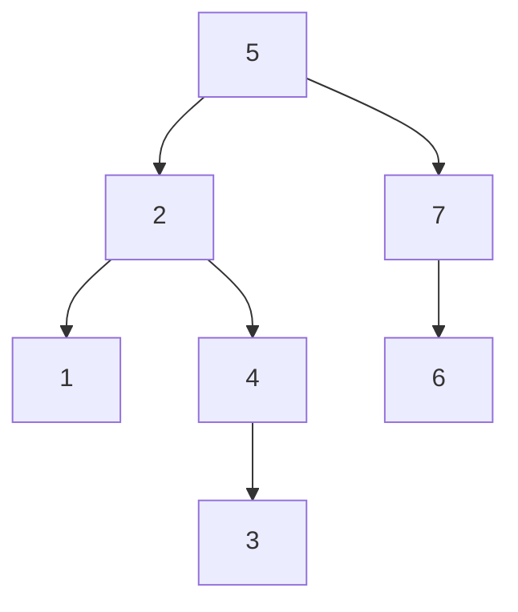

# [JavaScript 刷题] 二叉树搜索树

## 二叉搜索树的概念与搜索

二叉搜索树是二叉树的一种特殊形式，因此也只有左右两个子树，除此之外，二叉树还要满足以下三个特性：

1. 左子树的值必须全都 **小于** 当前结点的值
2. 右子树的值必须全都 **大于** 当前结点的值
3. 每一个二叉搜索树的子树都是一个二叉搜索树

如下图就是一个二叉树：

以上面这棵二叉平衡树为例，root 是 5，所有 root 的左子树值均小于 5，root 的右子树均大于 5. 同样，每棵子树本身也是一个二叉平衡树，因此

画图用的是 mermaid，所以比较难看出 7 下面的是左子树还是右子树。不过 $6 < 7$，所以这里其实是左子树。

二叉树的搜索和验证相对而言是比较简单的，只需要遵从二叉搜索树的 3 个特性进行遍历即可。

相关练习题：

- [leetcode 98. 验证二叉搜索树](https://goldenaarcher.blog.csdn.net/article/details/125425574)

- [二叉搜索树迭代器](https://goldenaarcher.blog.csdn.net/article/details/125454664)
- 700. Search in a Binary Search Tree

## 二叉搜索树的新增

新增二叉搜索树其实不难，稍微难/麻烦一点的是平衡二叉树，二叉树的新增可以参考一下这篇笔记：[701. Insert into a Binary Search Tree]()

## 二叉搜索树的删除
