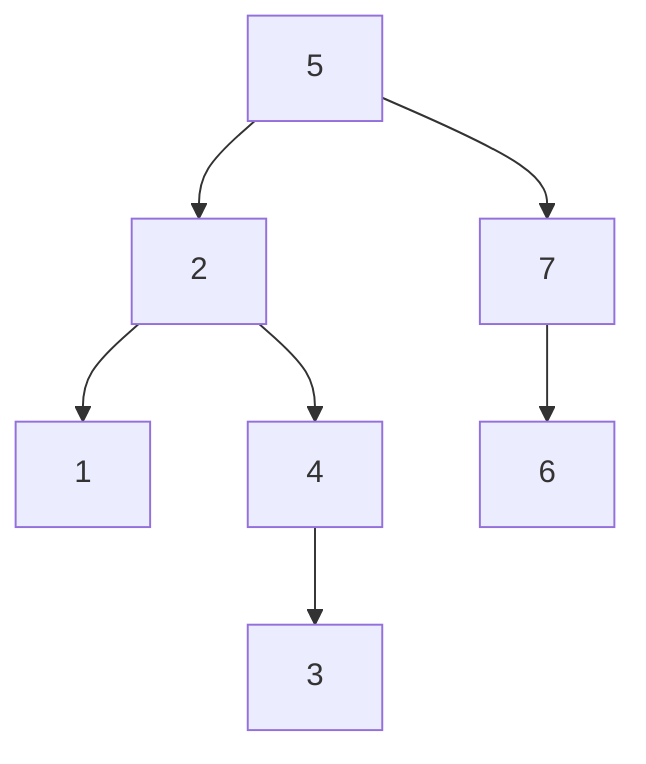

# [JavaScript 刷题] 二叉树搜索树

## 二叉搜索树的概念与搜索

二叉搜索树是二叉树的一种特殊形式，因此也只有左右两个子树，除此之外，二叉树还要满足以下三个特性：

1. 左子树的值必须全都 **小于** 当前结点的值
2. 右子树的值必须全都 **大于** 当前结点的值
3. 每一个二叉搜索树的子树都是一个二叉搜索树

如下图就是一个二叉树：

以上面这棵二叉平衡树为例，root 是 5，所有 root 的左子树值均小于 5，root 的右子树均大于 5. 同样，每棵子树本身也是一个二叉平衡树，因此

画图用的是 mermaid，所以比较难看出 7 下面的是左子树还是右子树。不过 $6 < 7$，所以这里其实是左子树。

二叉树的搜索和验证相对而言是比较简单的，只需要遵从二叉搜索树的 3 个特性进行遍历即可。

相关练习题：

- [leetcode 98. 验证二叉搜索树](https://goldenaarcher.blog.csdn.net/article/details/125425574)

- [二叉搜索树迭代器](https://goldenaarcher.blog.csdn.net/article/details/125454664)
- 700. Search in a Binary Search Tree

## 二叉搜索树的新增

新增二叉搜索树其实不难，稍微难/麻烦一点的是平衡二叉树，二叉树的新增可以参考一下这篇笔记：[二叉搜索树中的插入操作](https://goldenaarcher.blog.csdn.net/article/details/125458856)

我写的解法不是最有效的，但是我觉得对我来说是最好理解的。

用二叉搜索树删除结点这道题来说，如果要将 3 重新加回到二叉树中，上面这个解法会将 3 加到 2 的右子树中，同样也是合法的二叉搜索树，不过不是一棵平衡二叉搜索树。

这里主要的做法就是利用不会出现重复数字的特性，一直对树的结点进行遍历，如果当前结点的值大于本身要找的数字，就在该节点的左子树中进行搜索，反之在右子树中进行搜索。

一直找到某个结点的左/右子树为空时进行插入即可。

## 二叉搜索树的删除

删除的笔记在这里：[删除二叉搜索树中的节点](https://goldenaarcher.blog.csdn.net/article/details/125466404)，这个解法也不是最理想的解，用笔记中的图来说，原本的二叉搜索树如下：

解完后如下：

这个做法是将被删除结点的右子树提上来，替换当前子树。随后找到该子树(右子树) 的最左侧结点，将原本的左子树(这里时 `[5, 4]`) 挂上去即可。

非平衡二叉树的高度($h$) 的取值范围在 $0 \leqq h \leq n$，所以是没有办法保证 $O(log(n))$ 的。
