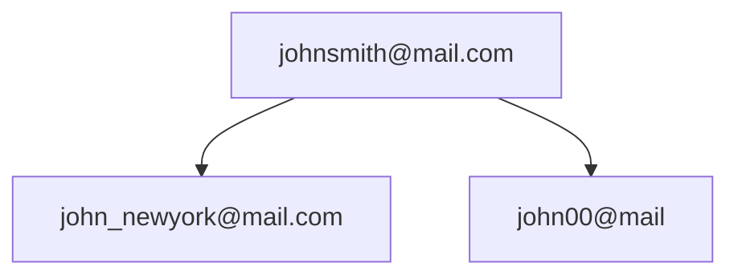
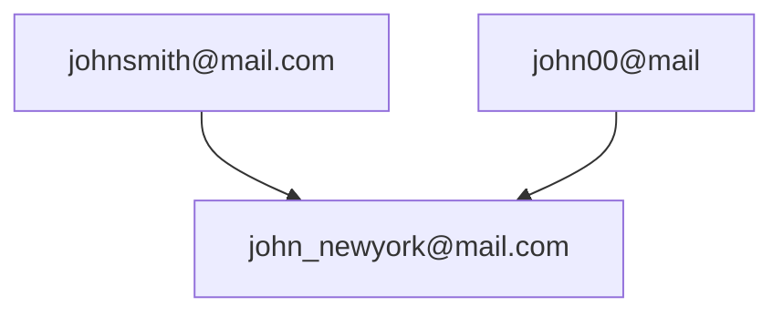

# 并查集三道题

使用的基础代码都是 [并查集(Data Structure for Disjoint Sets)](https://goldenaarcher.blog.csdn.net/article/details/127711899) 中放的，一点变动都没有，主要的变动就是放在调用函数里面操作了。

唔，没啥讲解因为我觉得 [并查集(Data Structure for Disjoint Sets)](https://goldenaarcher.blog.csdn.net/article/details/127711899) 讲得差不多了，题目也没放，感兴趣的可以直接跟着题号找一下题目。

## 200. 岛屿数量

这道题其实用 UF 解就很……冗长，不过用来练手还不错：

```javascript
class UnionFind {
  constructor() {
    this.rank = {};
    this.parents = {};
  }

  makeSet(x) {
    this.parents[x] = x;
    this.rank[x] = 0;
  }

  findSet(x) {
    if (this.parents[x] !== this.parents[this.parents[x]]) {
      this.parents[x] = this.findSet(this.parents[this.parents[x]]);
    }

    return this.parents[x];
  }

  link(x, y) {
    if (this.rank[x] > this.rank[y]) {
      this.parents[y] = x;
    } else {
      this.parents[x] = y;
      if (this.rank[x] === this.rank[y]) {
        this.rank[y] = this.rank[y] + 1;
      }
    }
  }

  union(x, y) {
    this.link(this.findSet(x), this.findSet(y));
  }
}

const numIslands = (grid) => {
  const unionFind = new UnionFind();
  const R = grid.length,
    C = grid[0].length,
    DIRECTIONS = [
      [1, 0],
      [-1, 0],
      [0, 1],
      [0, -1],
    ];

  const getKey = (r, c) => `${r},${c}`;

  let numsOfIsland = 0;

  for (let r = 0; r < R; r++) {
    for (let c = 0; c < C; c++) {
      if (grid[r][c] === "1") {
        unionFind.makeSet(getKey(r, c));
        numsOfIsland++;
      }
    }
  }

  for (let r = 0; r < R; r++) {
    for (let c = 0; c < C; c++) {
      if (grid[r][c] === "1") {
        const parent = unionFind.findSet(getKey(r, c));
        for (const [x, y] of DIRECTIONS) {
          const nextR = r + x,
            nextC = c + y;

          if (nextR >= 0 && nextR < R && grid[nextR][nextC] === "1") {
            const nextParent = unionFind.findSet(getKey(nextR, nextC));

            if (unionFind.parents[parent] !== unionFind.parents[nextParent]) {
              unionFind.union(parent, nextParent);
              numsOfIsland--;
            }
          }
        }
      }
    }
  }

  return numsOfIsland;
};
```

基本逻辑就是先将所有值为 $1$ 的地方全都默认成是一个岛，随后在遍历的时候将关联的岛屿 union 起来。如果二者的 parent 一样的话就不需要连接，如果不一样又正好是在 上下左右 四个方向上就进行连接。

还是那句话，用 DFS 或者 BSF 就方便很多了。

## 721. 合并账号

这道题我觉得使用 UF 比 DFS 好理解的题目，代码如下：

```javascript
class UnionFind {
  constructor() {
    this.rank = {};
    this.parents = {};
  }

  makeSet(x) {
    this.parents[x] = x;
    this.rank[x] = 0;
  }

  findSet(x) {
    if (this.parents[x] !== this.parents[this.parents[x]]) {
      this.parents[x] = this.findSet(this.parents[this.parents[x]]);
    }

    return this.parents[x];
  }

  link(x, y) {
    if (this.rank[x] > this.rank[y]) {
      this.parents[y] = x;
    } else {
      this.parents[x] = y;
      if (this.rank[x] === this.rank[y]) {
        this.rank[y] = this.rank[y] + 1;
      }
    }
  }

  union(x, y) {
    this.link(this.findSet(x), this.findSet(y));
  }
}

/**
 * @param {string[][]} accounts
 * @return {string[][]}
 */
const accountsMerge = (accounts) => {
  const unionFind = new UnionFind();
  const email2name = {};
  accounts.forEach(([name, ...emails]) => {
    emails.forEach((email) => {
      if (!unionFind.findSet(email)) unionFind.makeSet(email);
      unionFind.union(email, emails[0]);
      email2name[email] = name;
    });
  });

  const res = {};

  for (const [email, _] of Object.entries(email2name)) {
    const parent = unionFind.findSet(email);
    if (parent in res) {
      res[parent].push(email);
    } else {
      res[parent] = [email];
    }
  }

  return Object.keys(res).map((key) => [email2name[key], ...res[key].sort()]);
};
```

跟岛屿数量来说，这道题其实有用到路径压缩这个特性。

以题目中中的例子来说：

```javascript
const accounts = [
  ["John", "johnsmith@mail.com", "john_newyork@mail.com"],
  ["John", "johnsmith@mail.com", "john00@mail.com"],
  ["Mary", "mary@mail.com"],
  ["John", "johnnybravo@mail.com"],
];
```

同时将 `unionFind.union(email, emails[0]);` 这一段修改成 `unionFind.union(emails[0], email);`，乍一看就以为 `"johnsmith@mail.com"` 会关联两个 parent：



但是通过路径压缩，则会让所有的结点都指向同一个 parent，如下图：



主要还是因为在 `findSet()` 的函数中会进行检查，如果 `x.parent` 与 `x.parent.parent` 不一致，则会让二者指向同一个指针。

## 684. 冗余连接

这道题算是比较经典的 UF 题了，如果题目中没有需要说是找到最后一个边，感觉用 Floyd Cycle Detection 会简单很多来着，解法如下：

```javascript
class UnionFind {
  constructor() {
    this.rank = {};
    this.parents = {};
  }

  makeSet(x) {
    this.parents[x] = x;
    this.rank[x] = 0;
  }

  findSet(x) {
    if (this.parents[x] !== this.parents[this.parents[x]]) {
      this.parents[x] = this.findSet(this.parents[this.parents[x]]);
    }

    return this.parents[x];
  }

  link(x, y) {
    if (this.rank[x] > this.rank[y]) {
      this.parents[y] = x;
    } else {
      this.parents[x] = y;
      if (this.rank[x] === this.rank[y]) {
        this.rank[y] = this.rank[y] + 1;
      }
    }
  }

  union(x, y) {
    this.link(this.findSet(x), this.findSet(y));
  }
}

/**
 * @param {number[][]} edges
 * @return {number[]}
 */
var findRedundantConnection = function (edges) {
  const uf = new UnionFind();
  let edge = null;
  for (const [_, [start, end]] of Object.entries(edges)) {
    if (
      uf.findSet(start) &&
      uf.findSet(end) &&
      uf.findSet(start) === uf.findSet(end)
    ) {
      edge = [start, end];
      continue;
    }

    if (!uf.findSet(start)) uf.makeSet(start);
    if (!uf.findSet(end)) uf.makeSet(end);

    uf.union(start, end);
  }

  return edge;
};
```

我这里主要就是判断如果一条边的两个节点都已经存在于 UF 中，那么这条边就一定是多余的（会形成圈）。
